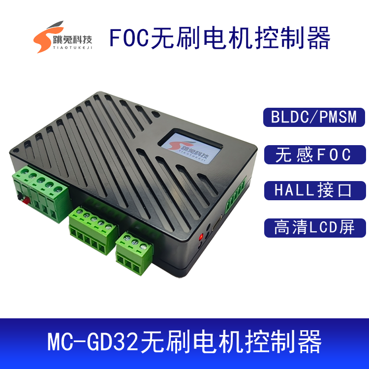

# MC_GD32

基于 GD32F303 的 FOC 无刷电机控制器

淘宝地址：

[https://item.taobao.com/item.htm?spm=a1z0k.1000777.0.0.77e537deL51T9A&id=816424031911&_u=t2dmg8j26111](https://item.taobao.com/item.htm?spm=a1z0k.1000777.0.0.77e537deL51T9A&id=816424031911&_u=t2dmg8j26111)
</img>

基于 GD32 ARM Cortex-M4 单片机，主频高达 120MHz，自带硬件浮点运算单元，借助 GD32F303 的零等待 FLASH，FOC 算法时间短

自带 2Kbit I2C 接口 EEPROM，可以保存电机参数等信息

1.14 寸  240*135 高清 LCD 屏幕

1 个电源指示LED灯，3 个状态指示 LED 灯

TYPEC 接口 USB 转 TTL ，高速率串口数据传输

2 盎司铜厚，大电流无压力，绿色 PCB，走线清晰可见一览无余，方便调试

支持 HALL 有感和无感无刷电机

带 1 路 CAN 通讯接口，可选终端电阻配置

支持 3.3V 对外供电，电流 100ma

3 个高度自定义 GPIO 口，可以接编码器、按键、UART 模块、温度传感器等模块

铝合金 CNC 外壳，黑色阳极氧化工艺 

软件基于 KEIL MDK5 进行开发

